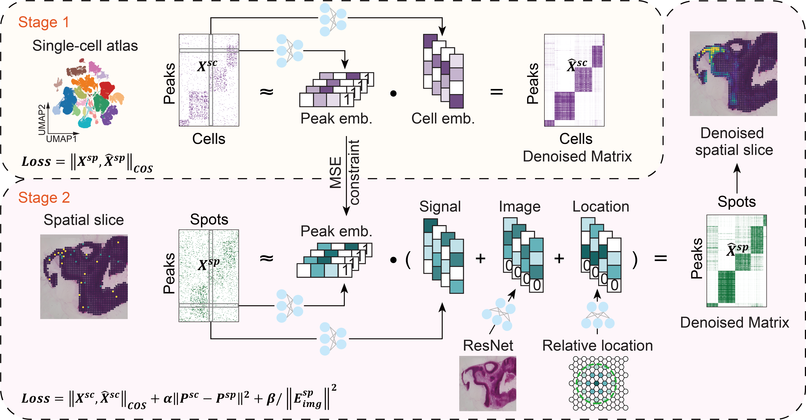

# SPEED
SPEED (**SP**atial **E**pig**E**nomic data **D**enoising by deep learning), a deep matrix factorization (DMF) framework using atlas level single cell data as prior and borrowing spatial location information for Spatial epigenomic data imputation and down-stream analysis



* Stage 1: Train the atlas-level single-cell data. 
* Stage 2: Train the spatial epigenomic data based on single-cell prior information (optional), spatial coordinate information, and H&E staining image information (optional).

* If high-quality single-cell data is unavailable, users can skip the first stage of training and train SPEED in the second stage without utilizing single-cell prior information.

## Getting started
* [Requirements](#Requirements)
* [Installation](#Installation)
* Tutorials
    * [SPEED tutorial (stage 1/2): Train on the atlas-level single-cell data](docs/tutorials/Tutorial_stage1_singlecell.ipynb)
    * [SPEED tutorial (stage 2/2): Train on the spatial epigenomic data based on prior information from single-cell data](docs/tutorials/Tutorial_stage2_MISAR.ipynb)
    * [SPEED tutorial : Train on the spatial epigenomic data without prior information from single-cell data](docs/tutorials/Tutorial_CUT_Tag.ipynb)
    * [SPEED tutorial : Training on the spatial epigenomic data based on prior information from single-cell data, without image data](docs/tutorials/Tutorial_ME13.ipynb)
    * [SPEED tutorial : Training on the simulation data](docs/tutorials/Tutorial_simulation.ipynb)

## Requirements

To install `SPEED`, you need to install [PyTorch](https://pytorch.org) with GPU support first. If you don't need GPU acceleration, you can just skip the installation for `cudatoolkit`.
* Create conda environment for `SPEED`:
```
    conda env create -f environment.yml
```

You must choose correct `PyTorch` and `cudatoolkit` version dependent on your graphic driver version. 

## Installation
* Install `SPEED`:
```
    git clone https://github.com/QuKunLab/SPEED.git
    pip install -e SPEED
```

Run the following code in Python to verify that SPEED is installed correctly.
```
    import SPEED
```

* Test if [PyTorch](https://pytorch.org) for GPU available:
```
    python
    >>> import torch
    >>> torch.cuda.is_available()
```
If these command line have not return `True`, please check your gpu driver version and `cudatoolkit` version. For more detail, look at [CUDA Toolkit Major Component Versions](https://docs.nvidia.com/cuda/cuda-toolkit-release-notes/index.html#cuda-major-component-versions).
